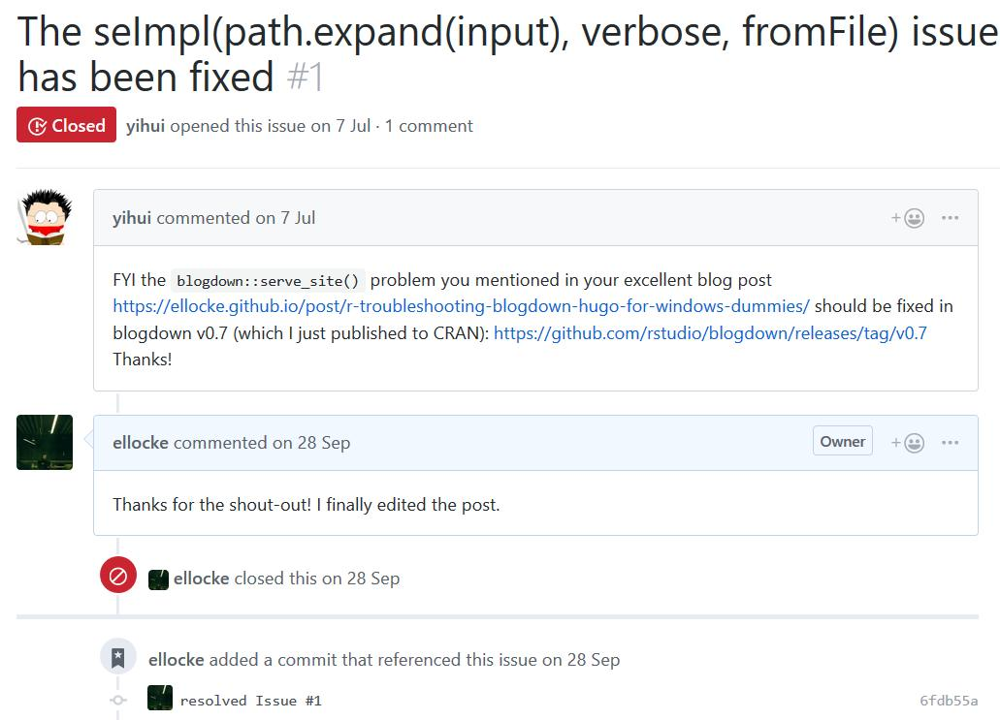
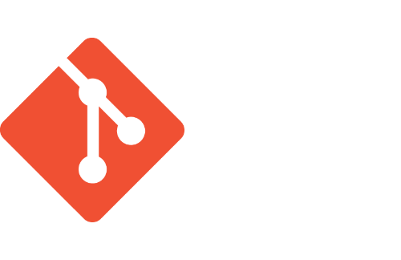
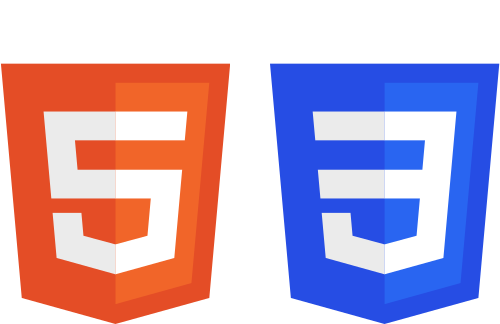
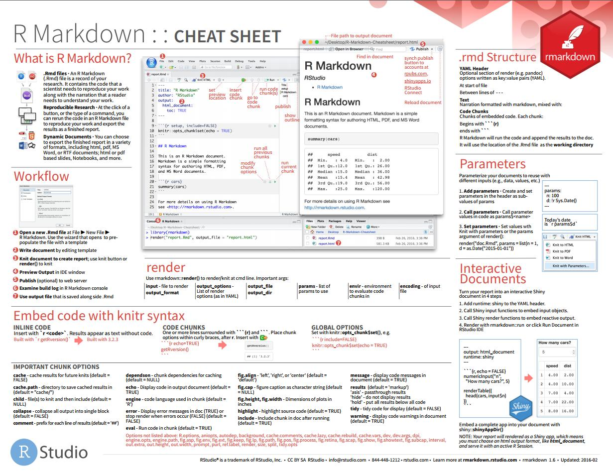
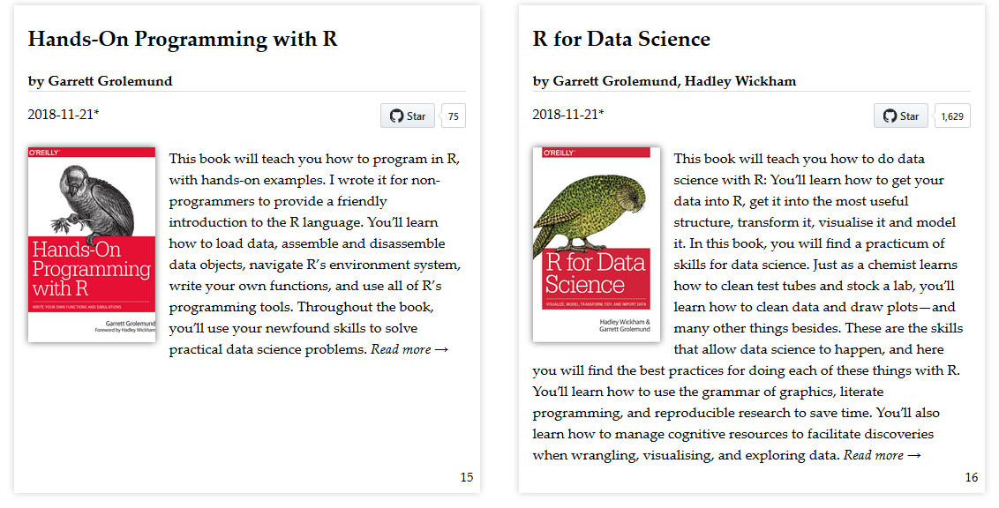
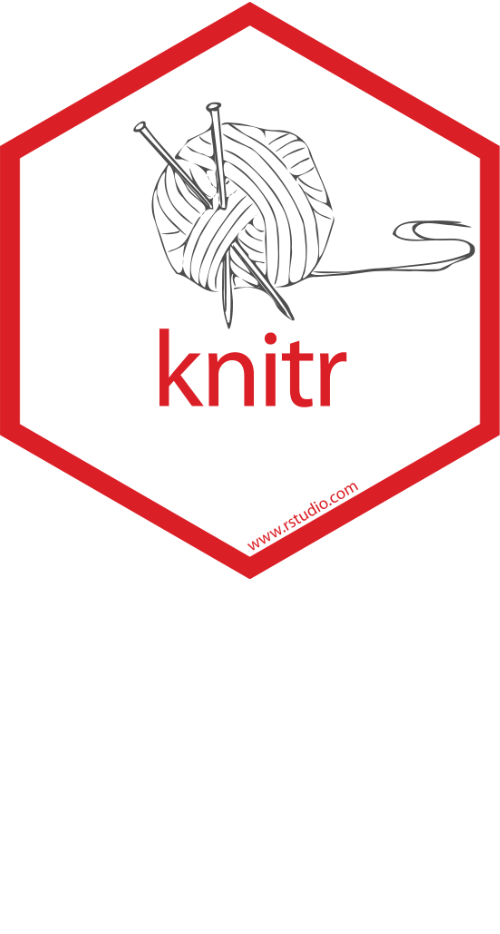

class: inverse 

```{r setup, include=FALSE}
options(htmltools.dir.version = FALSE)
```

# Outline

.TOC[
1. Why Blog?
1. (R) Markdown & Blogdown
1. Demo / Hands-On
  * Setup
  * Write / Code / Publish
  * Customize
1. Why Hugo/Static?
]

???
Questionaire!
---
class: inverse 

# Why? Portfolio!

--

.pull-left[.quote[
> “if you don’t have a website nowadays, you don’t exist” ([Scheidegger 2012 via Xie 2018](https://bookdown.org/yihui/blogdown/))

___


> "While a resume matters, having a portfolio of **public evidence of your data science skills** can do wonders for your job prospects. Even if you have a referral, the ability to show potential employers what you can do instead of just telling them you can do something is important." ([Galarnyk 2018](https://towardsdatascience.com/how-to-build-a-data-science-portfolio-5f566517c79c))

]
]

--

.pull-right[


([Galarnyk 2018: How to Build a Data Science Portfolio](https://towardsdatascience.com/how-to-build-a-data-science-portfolio-5f566517c79c))
]

---
class: inverse 

# Why? Visibility!

.pull-left[.quote[
> "The most effective strategy for me was doing **public work**. I blogged and did a lot of open source development late in my PhD, and these helped give public evidence of my data science skills." (["@drob" Robinson 2018](https://blog.modeanalytics.com/data-scientists-making-the-leap-academia-to-industry/))

]
]

--

.pull-right[.quote[
> "A well-designed and maintained website can be extremely helpful for other people **to know you**, and you do not need to wait for suitable chances at conferences or other occasions to introduce yourself in person to other people." ([Xie 2018](https://bookdown.org/yihui/blogdown/))

___

> "On the other hand, a website is also highly useful for yourself to **keep track** of what you have done and thought. Sometimes you may go back to a certain old post of yours to **relearn the tricks or methods** you once mastered in the past but have forgotten." ([Xie 2018](https://bookdown.org/yihui/blogdown/))

]
]

---
class: inverse, center

# Why? Open Source, Open Science, Replication!


### Sharing is caring!

--

.imgblock[


]

.source[

(Source: <a href="//commons.wikimedia.org/wiki/User:Gegensystem" title="User:Gegensystem">Andreas E. Neuhold</a>, <a href="https://creativecommons.org/licenses/by/3.0" title="Creative Commons Attribution 3.0">CC BY 3.0</a>, <a href="https://commons.wikimedia.org/w/index.php?curid=33542838">Link</a>)

]

---
class: inverse, center



---
class: inverse, center, 

# The Formula

--

.flex[

(


+



)

+




.flex[

=


]

]

---
class: inverse 

# First, there was Markdown
 
--
### \# Headings (H1-H6)

--

plain text, \*\***bold**\*\*, \**italic*\*, \~\~~~strike-through~~\~\~, \[[URL](https://example.com)\]\(https://example.com \)


--

> \> Blockquotes

--

1. lists
  + \+ nested lists

--

pretty `inline code` chunks

--

```{r eval=FALSE}
block code chunks
fun()
```

--

LaTex-like formulas:

$$\bar{X}=\frac{1}{n}\sum_{i=1}^nX_i$$

---
class: inverse

# Then there was Base R / R GUI

.imgblock[


]

---
class: inverse

# And then came ~~RStudio~~ Yihui Xie

--

.pull-left[
]

--

.pull-right[
+ software engineer at RStudio (since 2013)
+ PhD from the Dept. of Statistics, Iowa State University
+ Twitter: [@xieyihui](https://twitter.com/xieyihui)
+ Initiator of Chinese R Conference (in 2008!)


]


---
class: inverse
background-image: url(img/yihuiverse.png)
background-size: cover

# ~~"YihuiVerse"~~ <br /> R Rmarkdown Ecosystem

.pull-left[
.largest[

[yihui.name/en/](https://yihui.name/en/)

[github.com/yihui/](https://github.com/yihui)

]
]
---
class: inverse

# R + Markdown = RMarkdown

--

.pull-left[.quote[
 "With R Markdown, you only need to maintain the **source** documents; all output pages can be automatically generated from source documents. This makes it much easier to maintain a website, especially when the website is related to **data analysis or statistical computing and graphics**.
___ 
When the source code is updated (e.g., the model or data is changed), your web pages can be **updated** accordingly and **automatically**. *There is no need to run the code separately and cut-and-paste again*. Besides the convenience, you gain **reproducibility** at the same time." ([Xie 2018](https://bookdown.org/yihui/blogdown/r-markdown.html))
]
]
--

.pull-right[
.larger[

+ Markdown+ Text

+ `Code/Syntax` + Output

+ shareable `.Rmd`

+ Code + Layout are completly separated

+ One Workflow / a single source / a single IDE

+ Portability

+ Version control

]
]

---
class: inverse, center

.bigpicture-source[

]

[RStudio: R Markdown Cheat Sheet](https://www.rstudio.com/resources/cheatsheets/)

---
class: inverse, center

# Documention

.imgblock[


]

.centerblock[
+ [https://bookdown.org/yihui/rmarkdown/](https://bookdown.org/yihui/rmarkdown/)
+ [https://bookdown.org/yihui/bookdown/](https://bookdown.org/yihui/bookdown/)
+ [https://bookdown.org/yihui/blogdown/](https://bookdown.org/yihui/blogdown/)
]

---
class: inverse, center

# Bookdown



[https://r4ds.had.co.nz/](https://r4ds.had.co.nz/)

???
Today: Focus on Blogdown

---
class: inverse, center

# The Formula!

--
.flex[


&nbsp;\> 



&nbsp;\> 

*](img/hugo.png)

]

---
class: inverse, center, middle

# = Blogdown

.bigpicture[


]

---
class: inverse, center

# Blogdown: Setup

--

### I. Install Blogdown

```{r eval=FALSE}
install.packages("blogdown")
```

--

### II. Install Hugo

```{r eval=FALSE}
blogdown::install_hugo()
```

--

### III. RStudio: New Site

`File -> New Project -> Website using Blogdown`

OR

```{r eval=FALSE}
blogdown::new_site()
```

--

* There are tons of excellent how-to's, i.e. by [Tyler Clavelle](https://tclavelle.github.io/blog/blogdown_github/)

---
class: inverse

# 2+1 Commands To Rule Them All

--

### I. Preview locally with/out visibility in local network
`blogdown::serve_site(host = '0.0.0.0')` / `blogdown::serve_site()`

--

### II. Build to /public
`blogdown::hugo_build()`

--
___

### III. (Publish)
`git commit -m "updated Twitter Post"` / `git push`

---
class: inverse, center

# Demo

--

### I. Markdown Post

--

### II. Blogdown Post

--

### III. Theme + CSS

--
.quote[
“If you do not understand HTML, CSS, or JavaScript, and have no experience with Hugo themes or templates, it may take you about **10 minutes to get started** with your new website, since you have to accept everything you are given (such as the default theme); if you do have the knowledge and experience (and desire to highly customize your site), it may take you **several days** to get started. Hugo is really powerful. Be cautious with power.” ([Xie et al. 2018, Ch. 1.6](https://bookdown.org/yihui/blogdown/other-themes.html))
]

--
___

> (cf. [modded theme](https://dadascience.design/) with [source](https://blog.olowolo.com/example-site/))

---
class: inverse

# More Features

.larger[
* Shortcodes (i.e. ``)

* CSS + JS

* RSS

* Source File

* `static/other`
  + i.e. [slides](https://dadascience.design/talks/rblogdown/rblogdown.html#1) for this talk
  + `R/build.R` from `/static/talks/index.Rmd`

___

* **[Widgets](https://dadascience.design/post/r-demo-blogdown-madness-with-htmlwidgets/)**
]

---
class: inverse

# Tips & Tweaks

.larger[
* set up Hugo properly -> [`hugo -v`](https://dadascience.design/post/r-troubleshooting-blogdown-hugo-for-windows-dummies/)

* change `/public` folder (cf. [Blogdown Book](https://bookdown.org/yihui/blogdown/configuration.html#options))

* use [`here::here("static","data")`](https://github.com/jennybc/here_here#readme)

* Windows: Dual boot Linux OR put the Project Folder in root (255 path length limit!)

* use Git

* save objects with dynamic data (i.e. from API) locally

* DO NOT SAVE LARGE OBJECTS TO `/static/data`

]

---
class: inverse

# Why Static?

.larger[

* [Benefits of Static Site Generators](https://gohugo.io/about/benefits/)

* Ownership + Portability

* no DB & no Services (PHP et al.)

* no CMS + local building & testing

* Security (+2FA GitHub)

* GDPR compliance (i.e. DB, external CDN) (see [Hugo-specific discussion](https://discourse.gohugo.io/t/hugo-vs-the-general-data-protection-regulations-gdpr-in-eu-eea/11526) & [implementation](https://gohugo.io/about/hugo-and-gdpr/))


]

---
class: inverse, center, middle

# Thanks!

.largest[
[dadascience.design/talks](https://dadascience.design/talks)

[@fubits](https://twitter.com/fubits)
]

___

[CC BY-SA 4.0](https://creativecommons.org/licenses/by-sa/4.0/)

Slides created via the R package [**xaringan**](https://github.com/yihui/xaringan).
